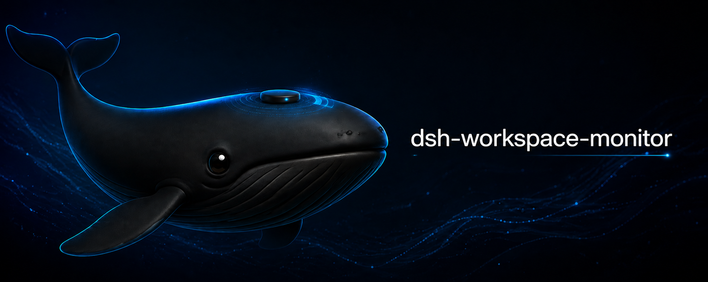

<div align="center">

# dsh-workspace-monitor

[](https://www.npmjs.com/package/dsh-workspace-monitor)
[](LICENSE)



</div>

## 安装

```bash
dsh plugin --profile desktop add dsh-workspace-monitor
```

## 快速开始

可以直接在当前会话中使用自然语言操作监测任务：

- "开始监测当前工作区"
- "列出监测"
- "把 `<taskId>` 改为每分钟"
- "停止监测 `<taskId>`"
- "继续监测 `<taskId>`"

同一个会话可以同时创建多个监测任务。每个任务都有独立的 `taskId`、工作区、扫描基线和运行状态；"列出监测"只列出当前会话拥有的任务。

## 运行规则

- 新任务默认每 60 秒扫描一次（`intervalMs: 60000`）。
- 可以在运行时修改间隔，例如"把 `<taskId>` 改为每分钟"；修改会立即作用于后续调度，不需要重启。
- 创建任务时先扫描一次并静默建立基线，不发送首轮变化通知。
- 从第二轮开始，每个周期都会发送扫描摘要；发现变化时列出新增、修改和删除，未发现变化时也会明确报告无变化。
- 扫描只读取文件元数据，不读取文件内容，也不写入被监测工作区。默认忽略 `.git`、`node_modules` 和 `.dsh-workspace-monitor`，并可通过配置调整扫描规模与摘要中的变化数量。
- "停止监测"会暂停任务；"继续监测"会恢复任务并执行一次补偿扫描，然后按原间隔继续运行。

### 重启后的状态

持久化任务在运行环境重启后不会自动继续执行。重启恢复时，原为 `ACTIVE` 的任务会先变为 `PAUSED`，并标记原因 `restart_requires_confirmation`；必须明确执行"继续监测 `<taskId>`"后才会恢复。暂停任务的扫描基线会保留。

## 配置与集成边界

插件包自带 `cordis.patch.yml`，默认配置如下：

```yaml
- insert:
    - id: dsh-workspace-monitor
      name: dsh-workspace-monitor
      config:
        intervalMs: 60000
        ignore: [.git, node_modules, .dsh-workspace-monitor]
        maxEntries: 100000
        maxChanges: 200
```

Desktop profile 是当前配置的主入口；旧的 Web 配置已移除。侧边任务栏集成留待后续阶段，本阶段尚未实现。

## 本地验证

在本项目目录执行：

```powershell
npm test
npm run check
npm run pack:check
```